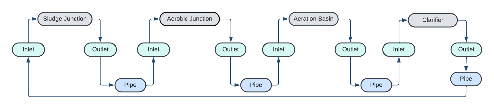

# Flow Graphs for Optimal Sensor Placement

To determine the **optimal locations for sensor placement** in a water treatment plant, we aim to monitor all water flows using the **fewest number of sensors**. This can be achieved by constructing a **flow graph**, where:

**Nodes** represent system components (e.g., equipments, junctions).

**Edges** represent water flows between these components.

We generate this graph from an RDF-based model of the plant. The graph abstraction implemented here is based on WWTP1, described in the paper ["Optimal flow sensor placement on wastewater treatment plants" by Villez et al. (2016)](https://doi.org/10.1016/j.watres.2016.05.068). We can identify a **minimal set of sensor placements** that covers all flows in the system.
## Graph Construction Using SPARQL Rules
In the RDF based model, equipments are connected indirectly through multiple steps.

**Each connection flows from:**  
  ```
  Equipment ->  Outlet Connection point -> Pipe -> Inlet Connection Point -> Equipment
  ```
This structure makes it complicated for optimal sensor placement. Therefore we simplify the topology as described by Villez et al. (2016), traversing only the most essential paths that reflect actual flow of material through pipes using SPARQL queries. We follow the connectsFrom and connectsTo relationships, to bypass intermediate nodes like connection points or junctions.

## Ensuring Graph Completeness

To make the graph **fully closed** (i.e., all flows are measured), we introduce a special node called **`Environment`**, which represents everything external to the system. This connects all **inflows** and **outflows** to a common endpoint.
This Prevents unconnected “open ends” where water appears or disappears which enforces flow conservation, and enables accurate modeling for optimal sensor placement.

We use **two SPARQL Rules** (Pipe Rule and Enviroment Rule) to extract the necessary structure from the RDF model and simplify it into a usable flow graph. These SPARQL rules:
- **Identify connections between equipments and pipes.**
- **Ignores non-essential intermediary nodes.**
- **Attach unconnected flow endpoints to the `Environment`.**


## Visual Transformation Overview

### Before: Raw RDF Graph
<sub>(equipment →Outlet Connection points → pipe → Inlet Connection points → equipment)</sub>  


### After: Simplified Flow Graph
<sub>(direct connections from one equipment to another, and environment closure)</sub>  


### Rule 1: Pipe Rule

Simplifies the topology by **removing intermediate connection points** and **directly links functional components**.

<pre>
PREFIX s223: &lt;http://data.ashrae.org/standard223#&gt;

SELECT ?from ?conn ?to WHERE {
    ?conn s223:connectsFrom ?from .
    ?conn s223:connectsTo ?to .
}
</pre>

## Step-by-step Explanation

- **PREFIX s223:**  
  Defines the shortcut for the ASHRAE 223P ontology namespace.

- **SELECT `?from` `?conn` `?to` tells SPARQL to return the source, pipe, and destination**  

- **`?conn` `s223:connectsFrom` `?from` identifies where the connection starts**

- **`?conn` `s223:connectsTo` `?to` identifies where it ends**

### Rule 2: Environment Rule

Links **unconnected inlets and outlets** to the `Environment` node while preserving **flow directionality**.

<pre>
PREFIX s223: &lt;http://data.ashrae.org/standard223#&gt;

SELECT ?from ?conn ?to WHERE {
    {
        ?to_orig rdf:type s223:OutletConnectionPoint .
        ?from s223:hasConnectionPoint ?to_orig .
        FILTER NOT EXISTS {
            ?to_orig s223:connectsThrough ?conn_orig
        }
        BIND("connects_to_env" AS ?conn)
        BIND("Environment" AS ?to)


    }
    UNION 
    {
        ?from_orig rdf:type s223:InletConnectionPoint .
        ?to s223:hasConnectionPoint ?from_orig .
        FILTER NOT EXISTS {
            ?from_orig s223:connectsThrough ?conn_orig
        }
        BIND("connects_to_env" AS ?conn)
        BIND("Environment" AS ?from)
    }
}
</pre>

## Step-by-step Explanation

- **SELECT ?from ?conn ?to**  
  Instructs SPARQL to return three values for each match:
  1. `?from` – the upstream device 
  2. `?conn` – the literal string `"connects_to_env"`
  3. `?to`   – the `Environment`

- **Branch 1 (Outlet):**  
  - `?to_orig rdf:type s223:OutletConnectionPoint`  
    Finds every outlet connection point. 
  - `?from s223:hasConnectionPoint ?to_orig`  
    Identifies every outlet connection point's source device.  
  - `FILTER NOT EXISTS { ?to_orig s223:connectsThrough ?conn_orig }`  
    Ensures no pipe is fedby this outlet.  
  - `BIND("connects_to_env" AS ?conn)`  
    Labels the relationship of device and Enviroment 
  - `BIND("Environment"     AS ?to)`  
    Marks the endpoint as `Environment`.  
  - **Resulting connection:**  
    ```
    Equipment-> connects_to_env -> Environment
    ```

- **Branch 2 (Inlet):**  
  - `?from_orig rdf:type s223:InletConnectionPoint`  
    Finds every inlet connection point.  
  - `?device s223:hasConnectionPoint ?from_orig`  
    Identifies every inlet connection point's source device.  
  - `FILTER NOT EXISTS { ?from_orig s223:connectsThrough ?conn_orig }`  
    Ensures no pipe feeds this inlet.  
  - `BIND("connects_to_env" AS ?conn)`  
     Labels the relationship of device and Enviroment 
  - `BIND("Environment"     AS ?from)`  
    Marks the source as `Environment`.  
  - **Resulting connection:**  
    ```
    Environment ->  connects_to_env -> Equipment
    ```


This will output a simplified RDF graph ready for sensor placement optimization.