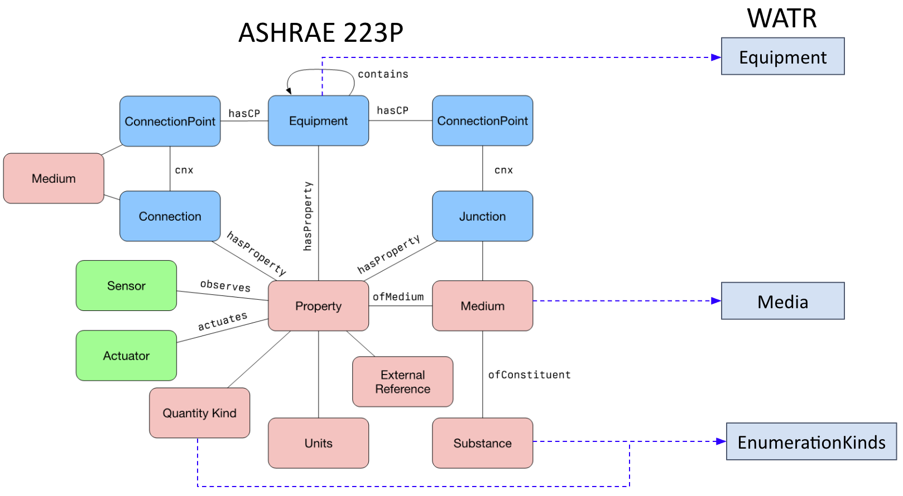

# WaTr Overview

The WaTr ontology represents information critical to the operation of water treatment systems, currently present in multiple different sources, to enable automated analytics, control, and data science in water treatment systems. 

## ASHRAE 223P Extension

ASHRAE Standard 223P is a consensus-based standard for creating machine-readable semantic models to represent automation and control data, and other building system information. It is focused on building mechanical, electrical, and plumbing systems, and designed to support the implementation of analytics and supervisory controls applications. The standard provides methods to contextualize time series data so that software applications can access the necessary data streams in an automated way. 

While its initial focus is building mechanical, electrical and plumbing systems, the modeling constructs defined for the ASHRAE 223P, and tools created to support it, are applicable to any process automation domain. The WaTr ontology extends ASHRAE 223P to support modeling of wastewater treatment systems. It does this by creating constructs for the types of equipment, processes, and chemicals. It reuses the structures for modeling mechanical systems defined in 223P. 

## Type

This standard provides well-defined classes used to describe entities relevant to water treatment system information. Entities in WaTr models will generally be instances of the many classes defined or referred to by the standard. The classes in the standard provide 'names' for the fundamental building blocks used in WaTr models (e.g. a pump will be an instance of the class `watr:Pump`) and also have rules defining how they are used (e.g. a pump must convey water).

## Topology

This standard can be used to describe the topology of the equipment and connections in a water treatment system, but not the geometric details. Topology refers to the way entities are connected and how some media (e.g. water, chemicals) is conveyed between them. There are several different classes used to describe which entities participate in connections and how they connect: Connectables, which include the entities that are capable of connecting to each other; ConnectionPoints, which model where Connectables can be connected; and Connections, which describe physical things through which the medium is conveyed, like pipes or channels. These Mediums (e.g. water, chemicals) are defined as an EnumerationKind in the standard. There are also multiple relations used to describe the details of these connections, and how the multiple entities involved in a connection relate to each other. Though there are many relations to describe different perspectives of a connection, only `s223:cnx` needs to be manually added to the model, and the rest can be automatically added to the model through the process of inference.

## Composition

Composition is about what entities make up what other entities. For example, a piece of mechanical equipment like a reactor may in fact be made up of other pieces of mechanical equipment, such as a mixer and a heating element. Additionally, a treatment stage may be made up of several different processes that receive a similar treatment service, or a treatment train may be made up of different stages, reactors, or separators. Several different modeling constructs use the idea of composition. These modeling constructs include Equipment, which may contain other equipment (e.g. a reactor containing a mixer); Stages, which may have Processes that receive a similar treatment service; StageGroups, which group together similarly controlled Stages; Systems that represent a collection of interrelated Equipment; or PhysicalSpaces, which may contain other PhysicalSpaces as a treatment plant contains multiple reactors. PhysicalSpaces may also enclose ProcessSpaces, indicating that the ProcessSpace is completely within the PhysicalSpace. For example, a treatment plant (a PhysicalSpace) may enclose several different areas served by independently controlled processes (ProcessSpaces).

## Telemetry 

A WaTr model does not directly provide telemetric data about the real-time operation or past operation of the water treatment systems. It does provide information about the meaning or context of a given data point and it can link to a source of the data values so that an analytics application can find them. If the treatment system has a SCADA system, the model can provide the necessary information for analytics or controls software to learn which SCADA object and SCADA property corresponds to the desired piece of information.

In WaTr, *Properties* are representations of some quality or characteristic of the treatment system which might be observable, quantifiable, and/or actuatable. Properties may have an *external reference* which indicates where the information (i.e., data) corresponding to that property may be found -- this is commonly a SCADA object, but other types of external references are possible. There are multiple types of Properties, such as control points that can be written to (ActuatableProperties), sensor points that are observed (ObservableProperties), either of which can refer to enumerated (EnumerableProperty) or quantified (QuantifiableProperty) values. Properties may also be used for mathematical operations, including those that are common in a treatment system such as control logic. This idea is represented using FunctionBlocks. Properties also have many different characteristics which are described by a vocabulary of EnumerationKinds.

Unlike other ontologies like SSN/SOSA, Properties are *not* associated with the inherent phenomena. In WaTr, Properties are associated with a *single* sensor or actuator. Think of WaTr's Properties as the source of the measurement or value which eventually becomes exposed in the treatment management system as a "Point".

## Characteristics

A model can also describe the characteristics of the entities in a water treatment system. These characteristics express details about entities that are not otherwise expressed by the type, topology, or composition of the entity. Often, these characteristics are linked to specific instances in a model. For example, a characteristic of a pump would be its rated flow. Another pump in the same WaTr model may have a different rated flow, but it will use the same WaTr class (i.e. `watr:Pump`). These types of characteristics are modeled using Properties.

Properties also have various characteristics including their units, quantity kinds, enumeration kinds, and aspects. Units describe the unit (e.g. liters per second) of a QuantifiableProperty and quantity kinds describe the type of quantity that may be stated by means of units (e.g. flow rate). These are modeled using qudt ontologies. EnumerableProperties do not have units, but they have enumerated values that can be described by EnumerationKinds. Aspects establish the context of a Property. For example, if a Property has a FlowRate value of 10, aspects are used to state what that represents, such as a FlowRate limit during peak hours, etc. A Property can have any number of aspects, as needed to establish the context. Any EnumerationKind can be used as an aspect.