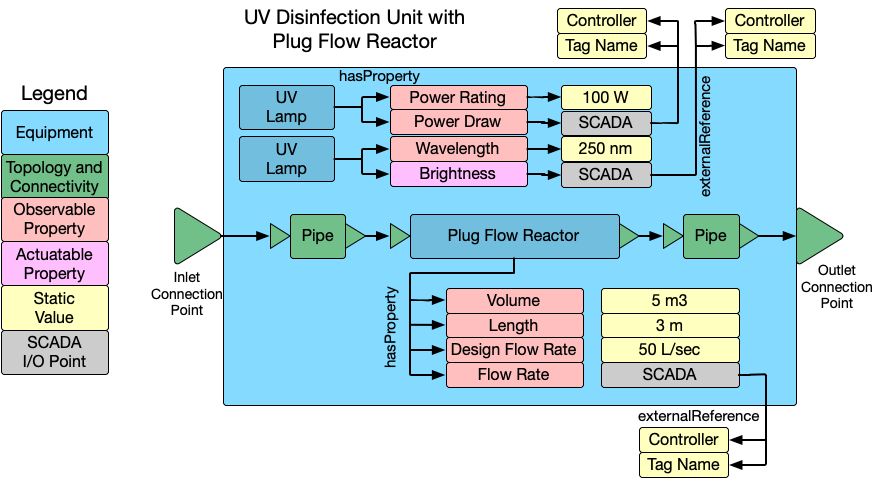

# Modeling Composition, Topology, and Processes

The WaTr ontology supports modeling the **processes** involved in a water treatment system (e.g. "UV disinfection), the **composition** of the system and its components (e.g. "this reactor contains a mixer"), and the **topology** of the system (e.g. "this pump is connected to this reactor").

To explain these concepts, we will use the following model of a ultraviolet disinfection system:



All of the polygons in this image represent a WaTr entity (a node in the graph) and the edges represent the relationships between them (the edges in the graph).

## Composition

WaTr uses the concept of **composition** to represent how entities are made up of other entities. For example, our UV disinfection system is made up of 2 UV lamps and a plug flow reactor.
We model this using the `s223:contains` relationship between the lamps and the unit process equipment, and the reactor and the unit process equipment.

```ttl
@prefix watr: <urn:nawi-water-ontology#> .
@prefix owl: <http://www.w3.org/2002/07/owl#> .
@prefix qudt: <http://qudt.org/schema/qudt/> .
@prefix qudtqk: <http://qudt.org/vocab/quantitykind/> .
@prefix rdfs: <http://www.w3.org/2000/01/rdf-schema#> .
@prefix s223: <http://data.ashrae.org/standard223#> .
@prefix unit: <http://qudt.org/vocab/unit/> .
@prefix : <urn:uv_example/> .

:UVDisinfectionSystem a watr:UnitProcess ;
    s223:contains :myPFR, :myUVLamp1, :myUVLamp2 .

:myPFR a watr:PlugFlowReactor .

:myUVLamp1 a watr:Lamp ;
    s223:hasProperty [
        a s223:QuantifiableObservableProperty ;
        qudt:hasQuantityKind qudtqk:Wavelength ;
        s223:hasValue 250 ;
        s223:hasUnit unit:NanoM ;
    ] .
:myUVLamp2 a watr:Lamp ;
    s223:hasProperty [
        a s223:QuantifiableObservableProperty ;
        qudt:hasQuantityKind qudtqk:Wavelength ;
        s223:hasValue 250 ;
        s223:hasUnit unit:NanoM ;
    ] .
```

To maintain that these are UV lamps, we included the modeling of the wavelength of the light they emit, which is a characteristic of the lamp. This is done using a `QuantifiableObservableProperty` that has a value of 250 nanometers and a unit of measurement.

## Topology

WaTr gets its topological model from the [ASHRAE 223 Standard](https://docs.open223.info/explanation/223_overview.html). This describes how `Connectables` connect to other `Connectables` through `Connections` and `ConnectionPoints`.

There is some nuance to the model to account for real-world complexities, but the basics are:
- `Connectables` are entities that can connect to other entities (e.g. a pump, a reactor, a valve, a unit process)
- `ConnectionPoints` are the "ports" on a `Connectable` that can connect to other `Connectables` (e.g. the inlet and outlet of a reactor). `ConnectionPoints` have a direction (inlet or outlet) and a medium (e.g. water, air, chemical). (See the docs [here](https://explore.open223.info/s223/ConnectionPoint.html)).
    - use the subclasses `InletConnectionPoint`, `OutletConnectionPoint`, `BidirectionalConnectionPoint` to represent the direction of the connection
    - WaTr defines a set of media that can be associated with the `ConnectionPoint`
- `Connections` are the physical things that connect `Connectables` together (e.g. a pipe, a channel, a duct). They have a `ConnectionPoint` on each end, and they convey a medium (e.g. water, air, chemical). (See the docs [here](https://explore.open223.info/s223/Connection.html).

You can see the connections (the `Pipe`s) and connection points in the image at the top of this page. `Equipment` is a subclass of `Connectable`, so it can have `ConnectionPoints` and `Connections`.

```ttl
@prefix watr: <urn:nawi-water-ontology#> .
@prefix owl: <http://www.w3.org/2002/07/owl#> .
@prefix qudt: <http://qudt.org/schema/qudt/> .
@prefix qudtqk: <http://qudt.org/vocab/quantitykind/> .
@prefix rdfs: <http://www.w3.org/2000/01/rdf-schema#> .
@prefix s223: <http://data.ashrae.org/standard223#> .
@prefix unit: <http://qudt.org/vocab/unit/> .
@prefix : <urn:uv_example/> .

# defines the "interface" to the unit process
:UVDisinfectionSystem a watr:UnitProcess ;
    s223:cnx :UVInlet, :UVOutlet .
:UVInlet a s223:InletConnectionPoint ;
    s223:hasMedium s223:Fluid-Water .
:UVOutlet a s223:OutletConnectionPoint ;
    s223:hasMedium s223:Fluid-Water .

# PFR participates with the inlet and outlet because
# water flows through it from the inlet to the outlet of
# the unit process
:myPFR a watr:PlugFlowReactor ;
    s223:cnx :PFRInlet, :PFROutlet .
:PFRInlet a s223:InletConnectionPoint ;
    s223:hasMedium s223:Fluid-Water ;
    s223:mapsTo :UVInlet .
:PFROutlet a s223:OutletConnectionPoint ;
    s223:hasMedium s223:Fluid-Water ;
    s223:mapsTo :UVOutlet .
```

We use [`s223:mapsTo`](https://explore.open223.info/s223/mapsTo.html) to relate the connection points of internal equipment to the connection points of the containing equipment. This allows us to model the connections between the unit process and the equipment inside it, for example.

## Processes

Tr is careful to differentiate between *what* a unit process is doing vs *how* that unit process is put together.
For example, our UV Disinfection System is a unit process that performs UV disinfection, but it is made up of a plug flow reactor and two UV lamps.
Another kind of UV disinfection system might use a different kind of reactor, or a different number of lamps, but it would still be performing UV disinfection.
WaTr is designed so that consumers of a WaTr graph can query for all unit processes that perform UV disinfection, regardless of how they are constructed.

The process enacted by a unit process is defined by the `watr:hasProcess` property.

```ttl
@prefix watr: <urn:nawi-water-ontology#> .
@prefix owl: <http://www.w3.org/2002/07/owl#> .
@prefix qudt: <http://qudt.org/schema/qudt/> .
@prefix qudtqk: <http://qudt.org/vocab/quantitykind/> .
@prefix rdfs: <http://www.w3.org/2000/01/rdf-schema#> .
@prefix s223: <http://data.ashrae.org/standard223#> .
@prefix unit: <http://qudt.org/vocab/unit/> .
@prefix : <urn:uv_example/> .
:UVDisinfectionSystem a watr:UnitProcess ;
    watr:hasProcess watr:Process-UltravioletDisinfection ;
.
```

WaTr defines a set of process types that can be used to describe the processes enacted by unit processes. These process types are defined in the `watr:Process` class and its subclasses. The process type is a high-level description of what the unit process does, without specifying how it is constructed.


## Putting It All Together

All of this information is captured in a single graph (the "WaTr model" of a treatment train). Below is the complete example of the UV disinfection system, including the composition, topology, and process information of this unit process.

```ttl
@prefix watr: <urn:nawi-water-ontology#> .
@prefix owl: <http://www.w3.org/2002/07/owl#> .
@prefix qudt: <http://qudt.org/schema/qudt/> .
@prefix qudtqk: <http://qudt.org/vocab/quantitykind/> .
@prefix rdfs: <http://www.w3.org/2000/01/rdf-schema#> .
@prefix s223: <http://data.ashrae.org/standard223#> .
@prefix unit: <http://qudt.org/vocab/unit/> .
@prefix : <urn:uv_example/> .
:UVDisinfectionSystem a watr:UnitProcess ;
    watr:hasProcess watr:Process-UltravioletDisinfection ;
    s223:contains :myPFR, :myUVLamp1, :myUVLamp2 ;
    s223:cnx :UVInlet, :UVOutlet .

:UVInlet a s223:InletConnectionPoint ;
    s223:hasMedium s223:Fluid-Water .
:UVOutlet a s223:OutletConnectionPoint ;
    s223:hasMedium s223:Fluid-Water .

:myPFR a watr:PlugFlowReactor ;
    s223:cnx :PFRInlet, :PFROutlet .
:PFRInlet a s223:InletConnectionPoint ;
    s223:hasMedium s223:Fluid-Water ;
    s223:mapsTo :UVInlet .
:PFROutlet a s223:OutletConnectionPoint ;
    s223:hasMedium s223:Fluid-Water ;
    s223:mapsTo :UVOutlet .

:myUVLamp1 a watr:Lamp ;
    s223:hasProperty [
        a s223:QuantifiableObservableProperty ;
        qudt:hasQuantityKind qudtqk:Wavelength ;
        s223:hasValue 250 ;
        s223:hasUnit unit:NanoM ;
    ] .
:myUVLamp2 a watr:Lamp ;
    s223:hasProperty [
        a s223:QuantifiableObservableProperty ;
        qudt:hasQuantityKind qudtqk:Wavelength ;
        s223:hasValue 250 ;
        s223:hasUnit unit:NanoM ;
    ] .
```
