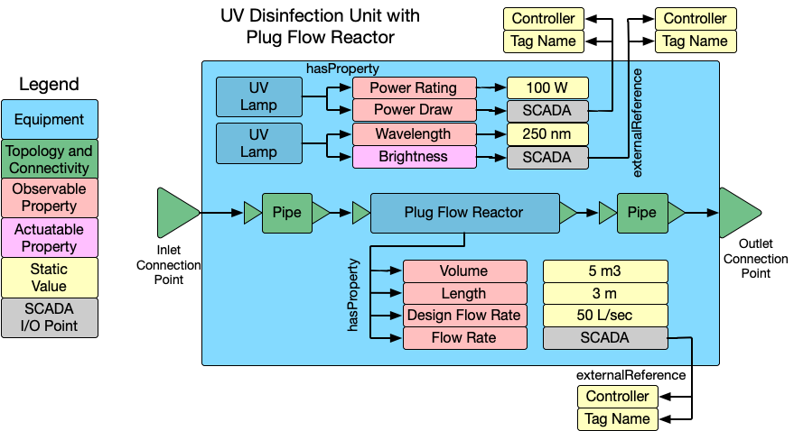

# Modeling Composition, Topology, and Processes

The WaTr ontology supports modeling the **processes** involved in a water treatment system (e.g. "UV disinfection), the **composition** of the system and its components (e.g. "this reactor contains a mixer"), and the **topology** of the system (e.g. "this pump is connected to this reactor").

To explain these concepts, we will use the following model of a ultraviolet disinfection system:



All of the polygons in this image represent a WaTr entity (a node in the graph) and the edges represent the relationships between them (the edges in the graph).

## Composition

WaTr uses the concept of **composition** to represent how entities are made up of other entities. For example, our UV disinfection system is made up of 2 UV lamps and a plug flow reactor.
We model this using the `s223:contains` relationship between the lamps and the unit process equipment, and the reactor and the unit process equipment.

```ttl
@prefix watr: <urn:nawi-water-ontology#> .
@prefix owl: <http://www.w3.org/2002/07/owl#> .
@prefix qudt: <http://qudt.org/schema/qudt/> .
@prefix qudtqk: <http://qudt.org/vocab/quantitykind/> .
@prefix rdfs: <http://www.w3.org/2000/01/rdf-schema#> .
@prefix s223: <http://data.ashrae.org/standard223#> .
@prefix unit: <http://qudt.org/vocab/unit/> .
@prefix : <urn:uv_example/> .

:UVDisinfectionSystem a watr:UnitProcess ;
    s223:contains :myPFR, :myUVLamp1, :myUVLamp2 .

:myPFR a watr:PlugFlowReactor .

:myUVLamp1 a watr:Lamp ;
    s223:hasProperty [
        a s223:QuantifiableObservableProperty ;
        qudt:hasQuantityKind qudtqk:Wavelength ;
        s223:hasValue 250 ;
        s223:hasUnit unit:NanoM ;
    ] .
:myUVLamp2 a watr:Lamp ;
    s223:hasProperty [
        a s223:QuantifiableObservableProperty ;
        qudt:hasQuantityKind qudtqk:Wavelength ;
        s223:hasValue 250 ;
        s223:hasUnit unit:NanoM ;
    ] .
```

To maintain that these are UV lamps, we included the modeling of the wavelength of the light they emit, which is a characteristic of the lamp. This is done using a `QuantifiableObservableProperty` that has a value of 250 nanometers and a unit of measurement.

## Topology

WaTr gets its topological model from the [ASHRAE 223 Standard](https://docs.open223.info/explanation/223_overview.html). This describes how `Connectables` connect to other `Connectables` through `Connections` and `ConnectionPoints`.

There is some nuance to the model to account for real-world complexities, but the basics are:
- `Connectables` are entities that can connect to other entities (e.g. a pump, a reactor, a valve, a unit process)
- `ConnectionPoints` are the "ports" on a `Connectable` that can connect to other `Connectables` (e.g. the inlet and outlet of a reactor). `ConnectionPoints` have a direction (inlet or outlet) and a medium (e.g. water, air, chemical). (See the docs [here](https://explore.open223.info/s223/ConnectionPoint.html)).
    - use the subclasses `InletConnectionPoint`, `OutletConnectionPoint`, `BidirectionalConnectionPoint` to represent the direction of the connection
    - WaTr defines a set of media that can be associated with the `ConnectionPoint`
- `Connections` are the physical things that connect `Connectables` together (e.g. a pipe, a channel, a duct). They have a `ConnectionPoint` on each end, and they convey a medium (e.g. water, air, chemical). (See the docs [here](https://explore.open223.info/s223/Connection.html).

You can see the connections (the `Pipe`s) and connection points in the image at the top of this page. `Equipment` is a subclass of `Connectable`, so it can have `ConnectionPoints` and `Connections`.

```ttl
@prefix watr: <urn:nawi-water-ontology#> .
@prefix owl: <http://www.w3.org/2002/07/owl#> .
@prefix qudt: <http://qudt.org/schema/qudt/> .
@prefix qudtqk: <http://qudt.org/vocab/quantitykind/> .
@prefix rdfs: <http://www.w3.org/2000/01/rdf-schema#> .
@prefix s223: <http://data.ashrae.org/standard223#> .
@prefix unit: <http://qudt.org/vocab/unit/> .
@prefix : <urn:uv_example/> .

# defines the "interface" to the unit process
:UVDisinfectionSystem a watr:UnitProcess ;
    s223:cnx :UVInlet, :UVOutlet .
:UVInlet a s223:InletConnectionPoint ;
    s223:hasMedium s223:Fluid-Water .
:UVOutlet a s223:OutletConnectionPoint ;
    s223:hasMedium s223:Fluid-Water .

# PFR participates with the inlet and outlet because
# water flows through it from the inlet to the outlet of
# the unit process
:myPFR a watr:PlugFlowReactor ;
    s223:cnx :PFRInlet, :PFROutlet .
:PFRInlet a s223:InletConnectionPoint ;
    s223:hasMedium s223:Fluid-Water ;
    s223:mapsTo :UVInlet .
:PFROutlet a s223:OutletConnectionPoint ;
    s223:hasMedium s223:Fluid-Water ;
    s223:mapsTo :UVOutlet .
```

We use [`s223:mapsTo`](https://explore.open223.info/s223/mapsTo.html) to relate the connection points of internal equipment to the connection points of the containing equipment. This allows us to model the connections between the unit process and the equipment inside it, for example.

### Media and Constituents

A `ConnectionPoint` or `Connection` carries a *medium* — the substance flowing through it (e.g. water, a chemical, air). S223 decides whether two media are *compatible* (so a connection point and a connection can be joined, or two connection points on the same equipment can carry different streams) by comparing the *constituents* the media are `s223:composedOf`. Two pure media are compatible only if one is a subclass of the other; two mixture media are compatible when they share at least one constituent (either the same one, or one that is a subclass of the other).

WaTr defines several aqueous media as subclasses of `s223:Fluid-Water`: `Water-Seawater`, `Water-Brackish`, `Water-Freshwater`, and `Water-Brine`. To make S223's compatibility rules recognize that these are all, fundamentally, water, each is declared `s223:composedOf` one or more constituents, sharing `s223:Constituent-H2O` with `s223:Fluid-Water` itself:

```ttl
@prefix rdfs: <http://www.w3.org/2000/01/rdf-schema#> .
@prefix s223: <http://data.ashrae.org/standard223#> .
@prefix watr: <urn:nawi-water-ontology#> .
@prefix qudt: <http://qudt.org/schema/qudt/> .
@prefix quantitykind: <http://qudt.org/vocab/quantitykind/> .
@prefix unit: <http://qudt.org/vocab/unit/> .

watr:Water-Seawater
    rdfs:subClassOf s223:Fluid-Water ;
    s223:composedOf [
        a s223:QuantifiableProperty ;
        s223:ofConstituent s223:Constituent-H2O ;
        qudt:hasQuantityKind quantitykind:MassFraction ;
        qudt:hasUnit unit:PERCENT ;
    ] ;
    s223:composedOf [
        a s223:QuantifiableProperty ;
        s223:ofConstituent watr:Salt-NaCl ;
        qudt:hasQuantityKind quantitykind:MassFraction ;
        qudt:hasUnit unit:PERCENT ;
    ] .
```

Because seawater, brackish water, brine, and freshwater all declare `s223:Constituent-H2O`, S223 treats them as mutually compatible — a single piece of equipment can accept a seawater feed and emit freshwater and brine streams without the validator flagging the distinct media as inconsistent. The saline media additionally declare `watr:Salt-NaCl`, so a modeler can pin a specific salinity on a concrete instance (see the `examples/brine-composition.ttl` and `examples/ro-mixture-test.ttl` examples). `Water-Freshwater` declares only `Constituent-H2O`, reflecting its negligible salt content. No salinity value is fixed at the class level; the classes act as reusable templates, and concrete salinity belongs to specific instances.

## Processes

Tr is careful to differentiate between *what* a unit process is doing vs *how* that unit process is put together.
For example, our UV Disinfection System is a unit process that performs UV disinfection, but it is made up of a plug flow reactor and two UV lamps.
Another kind of UV disinfection system might use a different kind of reactor, or a different number of lamps, but it would still be performing UV disinfection.
WaTr is designed so that consumers of a WaTr graph can query for all unit processes that perform UV disinfection, regardless of how they are constructed.

The process enacted by a unit process is defined by the `watr:hasProcess` property.

```ttl
@prefix watr: <urn:nawi-water-ontology#> .
@prefix owl: <http://www.w3.org/2002/07/owl#> .
@prefix qudt: <http://qudt.org/schema/qudt/> .
@prefix qudtqk: <http://qudt.org/vocab/quantitykind/> .
@prefix rdfs: <http://www.w3.org/2000/01/rdf-schema#> .
@prefix s223: <http://data.ashrae.org/standard223#> .
@prefix unit: <http://qudt.org/vocab/unit/> .
@prefix : <urn:uv_example/> .
:UVDisinfectionSystem a watr:UnitProcess ;
    watr:hasProcess watr:Process-UltravioletDisinfection ;
.
```

WaTr defines a set of process types that can be used to describe the processes enacted by unit processes. These process types are defined in the `watr:Process` class and its subclasses. The process type is a high-level description of what the unit process does, without specifying how it is constructed.

### Abstract and Concrete Process Requirements

Process types form a subclass hierarchy (e.g. `Process-ReverseOsmosis` is a `Process-MembraneProcess`, which is a `Process-Filtration`), and the equipment classes mirror that hierarchy: a `ReverseOsmosisMembrane` is a kind of `Filter`. WaTr expresses the `hasProcess` requirement as a pair of constraints that line up with these two hierarchies — an *abstract* parent says *what kind* of process the equipment performs, and a *concrete* subclass pins down *which one*:

```ttl
@prefix sh: <http://www.w3.org/ns/shacl#> .
@prefix watr: <urn:nawi-water-ontology#> .

watr:Filter
    sh:property [
        sh:path watr:hasProcess ;
        sh:qualifiedValueShape [ sh:class watr:Process-Filtration ] ;   # any filtration process
        sh:qualifiedMinCount 1 ;
    ] .

watr:ReverseOsmosisMembrane
    sh:property [
        sh:path watr:hasProcess ;
        sh:qualifiedValueShape [ sh:class watr:Process-ReverseOsmosis ] ;   # specifically RO
        sh:qualifiedMinCount 1 ;
    ] .
```

Because `Process-ReverseOsmosis` is an `rdfs:subClassOf` `Process-Filtration`, a single `watr:hasProcess watr:Process-ReverseOsmosis` on an instance satisfies *both* the inherited general requirement and the concrete one — the specific process counts as the general kind. The parents are effectively abstract: they describe the family of process the equipment performs, and the concrete subclass narrows it to the exact process. The same pattern is used for the digester, disinfection, and separation families (e.g. a `Digester` requires a `Process-Digestion`; an `AnaerobicDigester` requires a `Process-AnaerobicDigestion`).

### Why every process constraint is qualified

Each of these slots means "performs **at least** this process", never "performs **only** this process". That distinction is the whole reason for `sh:qualifiedValueShape` rather than a plain `sh:class`.

A bare `sh:class` on a property shape has to hold for *every* value on the path. Written that way, `watr:Filter` would not read as "a filter performs filtration" but as "*every* process a filter performs is a filtration" — which forbids the equipment from declaring anything else it does. Real equipment routinely does more than its defining process:

- a moving bed bioreactor aerates, both to supply oxygen and to keep its carriers circulating
- a `BiologicalAeratedFilter` aerates, as the name says
- a granular media filter backwashes
- an anaerobic digester mixes
- a sequencing batch reactor aerates

With qualified slots, all of these are expressible, and the abstract/concrete chain above still works unchanged:

```ttl
:myMBBR a watr:MovingBedBioreactor ;
    watr:hasProcess watr:Process-Biofiltration ,   # satisfies MBBR and, transitively, Filter
                    watr:Process-Aeration .        # additional, no longer rejected
```

The required process is still genuinely required — an MBBR declaring only aeration fails, and a `ReverseOsmosisMembrane` declaring only microfiltration fails. The qualified form simply stops the constraint from also forbidding everything else.

Two related pitfalls to avoid when writing these:

- **Do not use `sh:qualifiedValueShapesDisjoint true`.** The disjoint rule forbids a value from counting toward two sibling qualified shapes, so the single specific process would be rejected from both the parent's slot and the child's, and no concrete instance could validate. It is only meaningful within a single `sh:property` block that has *multiple* `sh:qualifiedValueShape` siblings.
- **Do not use `sh:maxCount` to mean "one process of this kind".** `sh:maxCount` caps the whole path, so it forbids additional processes just as a bare `sh:class` does. If a particular process must appear exactly once, use `sh:qualifiedMaxCount 1` on that slot.

The one place a bare `sh:class` is still correct is `watr:UnitProcess`, which requires every value to be a `watr:Process` — there, "every value" is exactly what is meant.

### Plausible additional processes

Permitting additional processes has a cost: nothing objects to an *implausible* one. A `ChlorinationUnit` declaring reverse osmosis is not something the constraints above can catch, because they only ever say what must be present, never what must be absent.

`watr:mayAlsoPerform` records what a piece of equipment plausibly does *besides* its defining process. `watr:ProcessPlausibilityShape` then warns about any `watr:hasProcess` value that falls outside the union of

- what the equipment's class, or any of its ancestors, **requires**, and
- what those classes list via **`watr:mayAlsoPerform`**.

The statements live on the abstract families, so subclasses inherit them:

| family | may also perform | rationale |
|---|---|---|
| `Tank` | Cleaning | any tank is drained or purged for maintenance |
| `Reactor` | Mixing, Aeration, Recirculation | reactors mix, aerate and recirculate alongside their defining reaction |
| `SeparationTank` | Recirculation | separated solids are returned to the head of the unit |
| `Filter` | Cleaning | backwashing, air scouring and purging are routine filter operations |
| `Digester` | GasTransfer | digesters draw off biogas (mixing is inherited from `Reactor`) |

Because `Digester` and `DisinfectionUnit` are both `Reactor` subclasses, an anaerobic digester may mix and a chlorination contact basin may mix without either needing its own statement. This is the intended way to use the property: **declare it on the family, not on every subclass**, and add a statement to a specific class only when it genuinely does something its family does not.

```ttl
watr:Filter
    watr:mayAlsoPerform watr:Process-Cleaning ;   # backwash, air scour, purge
    .
```

Two things to understand about this check:

**It is a warning, not a violation.** Implausible is not impossible, and a real plant may do something the ontology did not anticipate. A flagged model is still a valid WaTr model — `tests/test_validation.py` and the example tests validate at violation level, so these findings never fail them. If you hit a warning you disagree with, the fix is to add a `watr:mayAlsoPerform` statement to the appropriate class; that is the intended feedback loop, and the table above is expected to grow.

**It is a coarse filter.** It catches wildly wrong pairings — a chlorination unit doing reverse osmosis, a screen digesting sludge — and lets merely unusual ones through. Sharpening it further would mean per-class permission lists rather than per-family ones, which is a much larger amount of domain knowledge to elicit for a diminishing return.

One subtlety worth recording: the permission is not a claim that a process is "merely ancillary". `Process-Aeration` is permitted on any `Reactor` *and* is the defining process of `AerationBasin`; `Process-Mixing` is permitted broadly *and* defines `MixingBasin` and `StaticMixer`. Whether a process is ancillary depends on the equipment, not on the process — the same lesson as [purpose vs. mechanism](#purpose-vs-mechanism) above. `watr:mayAlsoPerform` gets away with being a global-ish list only because it grants permission rather than imposing a requirement: an over-generous entry merely fails to flag something, and can never make a legitimate model invalid.

### Purpose vs. Mechanism

The pattern above works because the concrete process *is a kind of* the abstract one — reverse osmosis is a kind of filtration, chlorination is a kind of disinfection. Some equipment is not like that. A belt thickener exists to **thicken** sludge, but the thing it physically does is **filter**. Thickening is the *purpose*; filtration is the *mechanism*. Filtration is not a kind of thickening — the two are unrelated branches of the process hierarchy — so an instance has to state both.

WaTr keeps these on two different relationships:

| | relationship | answers |
|---|---|---|
| Mechanism | `watr:hasProcess` | *what the equipment physically does* |
| Purpose | `s223:hasRole` | *what it is there to accomplish* |

`watr:hasProcess` carries mechanisms only. The process hierarchy is organized by mechanism from the top down — its first split is physical vs. chemical vs. biological, which is a statement about *means*, not *ends* — so a purpose placed there has nowhere sensible to sit.

Purposes go on `s223:hasRole`, which S223 already provides for exactly this, and which WaTr already uses for roles like `Role-NutrientRemoval`, `Role-Equalization`, and `Role-Primary`. Thickening and dewatering are modeled as `watr:Role-Thickening` and `watr:Role-Dewatering`, both subclasses of `watr:Role-SolidsHandling`:

```ttl
@prefix s223: <http://data.ashrae.org/standard223#> .
@prefix watr: <urn:nawi-water-ontology#> .
@prefix : <urn:example/> .

:myBeltThickener a watr:BeltThickener ;
    s223:hasRole watr:Role-Thickening ;      # what it is for
    watr:hasProcess watr:Process-Filtration ;  # how it does it
.
```

The equipment shapes follow the same split: `watr:Thickener` requires the *role*, and each concrete subclass requires the *mechanism* it thickens by (`BeltThickener` → filtration, `CentrifugalThickener` → centrifugation, `GravityThickener` → sedimentation). `watr:DewateringUnit` and its subclasses work the same way.

Both of these slots use `sh:qualifiedValueShape` rather than a bare `sh:class`, because a bare `sh:class` must hold for *every* value on the path:

- Equipment may carry several unrelated roles, so a bare `sh:class` on `s223:hasRole` would reject any role but the required one. This applies to *every* role constraint in WaTr, not just these two — `sh:in` has the same problem, which is why `AerationBasin` (aerobic or anoxic) and `MixingBasin` (anoxic or anaerobic) state their required role as a qualified `sh:in` rather than a bare one. A modeler can then add `Role-Primary`, `Role-Detention`, or any other role to a basin without tripping validation.
- Multiple inheritance can combine two mechanisms. A `GravityBeltThickener` is both a `BeltThickener` and a `GravityThickener`, so it performs filtration *and* sedimentation; a bare `sh:class` on either parent would demand every process be its own kind and reject the other.

This is the same rule as for the process constraints above: a shape saying "performs (or serves) at least this" is a `sh:qualifiedValueShape` with `sh:qualifiedMinCount 1`. A bare `sh:class` or `sh:in` says "every value must be this", which is almost never what an equipment class means.

When you are adding a new process type, the question to ask is whether it names something the equipment *does* or something it is *for*. If a piece of equipment could achieve it by more than one physical means — thickening by gravity, by centrifuge, or by belt — it is a role, not a process.


## Putting It All Together

All of this information is captured in a single graph (the "WaTr model" of a treatment train). Below is the complete example of the UV disinfection system, including the composition, topology, and process information of this unit process.

```ttl
@prefix watr: <urn:nawi-water-ontology#> .
@prefix owl: <http://www.w3.org/2002/07/owl#> .
@prefix qudt: <http://qudt.org/schema/qudt/> .
@prefix qudtqk: <http://qudt.org/vocab/quantitykind/> .
@prefix rdfs: <http://www.w3.org/2000/01/rdf-schema#> .
@prefix s223: <http://data.ashrae.org/standard223#> .
@prefix unit: <http://qudt.org/vocab/unit/> .
@prefix : <urn:uv_example/> .
:UVDisinfectionSystem a watr:UnitProcess ;
    watr:hasProcess watr:Process-UltravioletDisinfection ;
    s223:contains :myPFR, :myUVLamp1, :myUVLamp2 ;
    s223:cnx :UVInlet, :UVOutlet .

:UVInlet a s223:InletConnectionPoint ;
    s223:hasMedium s223:Fluid-Water .
:UVOutlet a s223:OutletConnectionPoint ;
    s223:hasMedium s223:Fluid-Water .

:myPFR a watr:PlugFlowReactor ;
    s223:cnx :PFRInlet, :PFROutlet .
:PFRInlet a s223:InletConnectionPoint ;
    s223:hasMedium s223:Fluid-Water ;
    s223:mapsTo :UVInlet .
:PFROutlet a s223:OutletConnectionPoint ;
    s223:hasMedium s223:Fluid-Water ;
    s223:mapsTo :UVOutlet .

:myUVLamp1 a watr:Lamp ;
    s223:hasProperty [
        a s223:QuantifiableObservableProperty ;
        qudt:hasQuantityKind qudtqk:Wavelength ;
        s223:hasValue 250 ;
        s223:hasUnit unit:NanoM ;
    ] .
:myUVLamp2 a watr:Lamp ;
    s223:hasProperty [
        a s223:QuantifiableObservableProperty ;
        qudt:hasQuantityKind qudtqk:Wavelength ;
        s223:hasValue 250 ;
        s223:hasUnit unit:NanoM ;
    ] .
```
